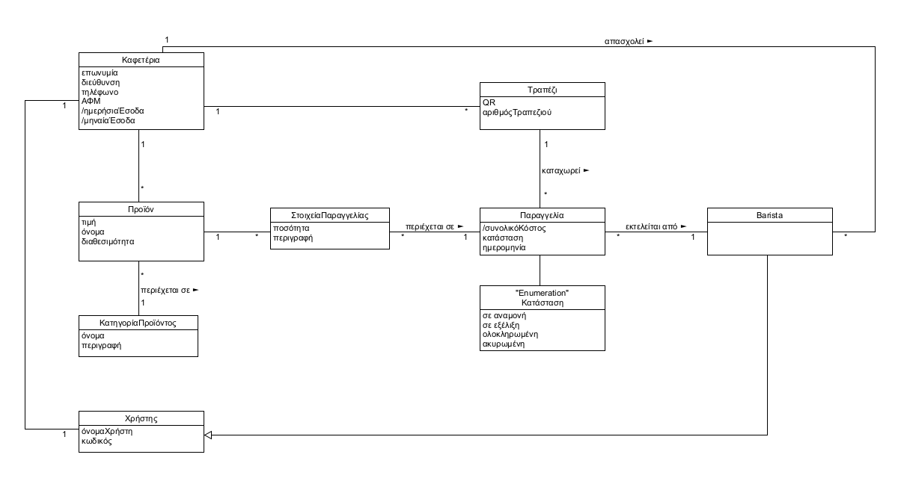

# Εφαρμογή παραγγελιοληψίας σε καφετέρια

Εφαρμογή όπου δίνεται η δυνατότητα στον χρήστη να παραγγείλει σε μία καφετέρια χωρίς επικοινωνία με κάποιο μέλος του προσωπικού.

Αρχικά, δίνεται η δυνατότητα στη διεύθυνση του καταστήματος να επεξεργαστεί το μενού που προσφέρει και να θέσει τις τιμές των προϊόντων.
Ύστερα ο πελάτης με τη χρήση του QR Code που υπάρχει στο τραπέζι του, μπορεί να ξεκινήσει τη πραγματοποίηση μιας παραγγελίας.
Μπορεί να διαλέξει και να τροποποιήσει είδη από το μενού και να τα προσθέσει στο καλάθι του. Στο τέλος, κατοχυρώνει την παραγγελία και η κατάσταση της τίθεται "Σε αναμονή".
Ο μπαρίστα του καταστήματος μπορεί να προβάλει τις εκκρεμείς παραγγελίες και να αλλάξει την κατάστασή τους σε "Σε εξέλιξη", "Ακυρωμένη" και "Ολοκληρωμένη".
Ο πελάτης μπορεί να παρακολουθεί την εξέλιξη της παραγγελίας του με τη χρήση του QR Code.
Τέλος, η διεύθυνση μπορεί να έχει πρόσβαση στα ημερήσια και μηνιαία έσοδα του καταστήματος.

## Απαιτήσεις Συστήματος
Η εφαρμογή αυτή προσφέρει στους **πελάτες** τις παρακάτω υπηρεσίες:

* ΠΧ1. [Να καταχωρήσουν την παραγγελία τους (προϊόντα, ποσότητες και σχόλια), μέσω του μοναδικού κωδικού (QR Code) του τραπεζιού τους](./docs/markdown/uc1-client-order.md)
* ΠΧ2. [Να παρακολουθούν την εξέλιξη της παραγγελίας τους (στάδιο προετοιμασίας της)](./docs/markdown/uc2-client-order-state.md)

Η **διεύθυνση** του καταστήματος μπορεί:

* ΠΧ3. [Να εισάγει τα στοιχεία της επιχείρησης (Όνομα, τηλέφωνο, διεύθυνση κλπ.) και να δημιουργήσει λογαριασμούς για τη σύνδεση των υπαλλήλων](./docs/markdown/uc3-manager-sign-up.md)
* ΠΧ4. [Να καταχωρήσει μοναδικό κωδικό (QR Code) για κάθε τραπέζι και να τα διαχειρίζεται](./docs/markdown/uc4-manager-tables-management.md)
* ΠΧ5. [Να εισάγει το μενού με τις τιμές του](./docs/markdown/uc5-manager-menu-management.md)
* ΠΧ6. [Να πληροφορείται για τα συνολικά ημερήσια και μηνιαία έσοδα](./docs/markdown/uc6-manager-records.md)

Ο **barista** έχει τη δυνατότητα:

* ΠΧ7. [Να συνδέεται στο σύστημα με τον λογαριασμό που δημιούργησε η διεύθυνση](./docs/markdown/uc7-barista-login.md)
* ΠΧ8. [Να εκτελεί την επόμενη παραγγελία](./docs/markdown/uc8-process-order.md)

Συγκεκριμένα, ο barista ξεκινάει να ετοιμάζει τις παραγγελίες με τη σειρά που τις λαμβάνει. Για κάθε προϊόν της παραγγελίας ελέγχει αν έχει τη δυνατότητα να το ετοιμάσει (αν έχει όλα τα απαραίτητα υλικά). Αν μπορεί, το φτιάχνει και το σημειώνει ως έτοιμο. Αλλιώς ενημερώνει τον πελάτη μέσω της εφαρμογής πως δεν είναι διαθέσιμο.

Το σύστημα πρέπει να κρατάει στη μνήμη τις ενεργές παραγγελίες για να τις διαχειρίζονται οι υπάλληλοι, καθώς και τα συνολικά ημερήσια και μηνιαία έσοδα για να πληροφορεί την διεύθυνση.

### Use case Diagram

### Domain Diagram

### Class Diagram

