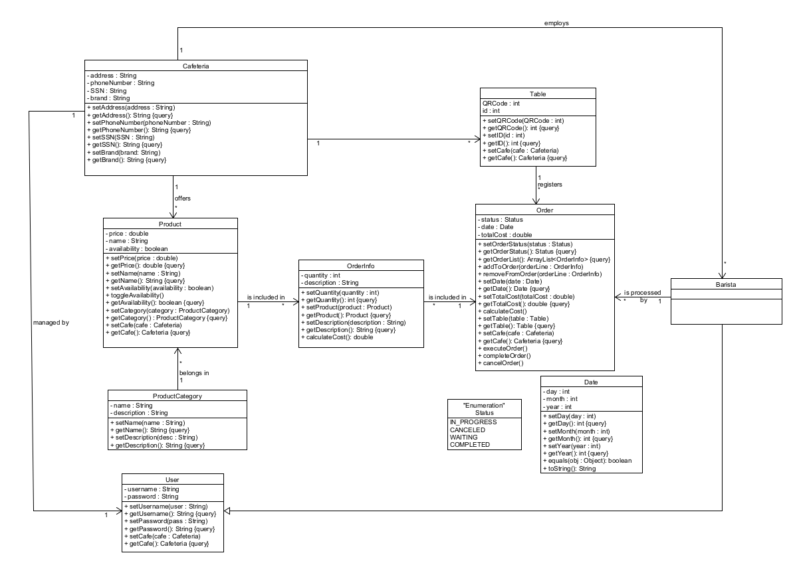

# Android ordering application for a cafeteria

_Created by: [Katerina Mantaraki](https://github.com/katerinamant), [Rea Sklika](https://github.com/reasklika), [Sofia Sotiriou](https://github.com/sofiasotiriou)_

- [Description](#description)
- [System Requirements](#system-requirements)
- [Use Case Diagram](#use-case-diagram)
- [Domain Model](#domain-model)
- [Class Diagram](#class-diagram)
- [Installation](#installation)
- [Screenshots](#screenshots)

## Description

Application for ordering in a cafeteria without interacting with any staff member.

Initially, the store's manager is given the ability to edit the menu it offers and set the prices of the products.
Then the customer, using the QR Code on their table, can start placing an order.
They can choose and modify items from the menu and add them to their cart. In the end, they confirm the order and its status is set to 'Pending'.
A barista of the cafeteria can view pending orders and change their status to 'In progress', 'Cancelled', or 'Completed'.
The customer can track the progress of their order using the QR Code.
Finally, the manager can access the store's daily and monthly income.

## System requirements

This application provides the following services to the **customers**:

- UC1. [To place their order (products, quantities, and comments) using the unique QR Code of their table](./docs/markdown/uc1-client-order.md)
- UC2. [To track the progress of their order](./docs/markdown/uc2-client-order-state.md)

The **manager** of the store can:

- UC3. [Enter business details (Name, phone, address, etc.) and create accounts for employee login](./docs/markdown/uc3-manager-sign-up.md)
- UC4. [Register unique QR codes for each table and manage them](./docs/markdown/uc4-manager-tables-management.md)
- UC5. [Enter the menu with its prices](./docs/markdown/uc5-manager-menu-management.md)
- UC6. [Access information about total daily and monthly income](./docs/markdown/uc6-manager-records.md)

The **barista** can:

- UC7. [Login to the system with the account created by the manager](./docs/markdown/uc7-barista-login.md)
- UC8. [Process the next order](./docs/markdown/uc8-process-order.md)

Specifically, the barista starts preparing orders in the order they are received. For each product in the order, they check if they can prepare it (if they have all the necessary ingredients). If they can, they make it and mark it as ready. Otherwise, they inform the customer through the application that it is unavailable.

The system must keep active orders in memory for baristas to handle, as well as total daily and monthly income to inform the manager.

## Use case Diagram

## Domain Model

## Class Diagram

## Installation

Before you begin, ensure:

- You have Android Studio installed on your machine. You can find more information [here](https://developer.android.com/studio).
- You have set up a compatible Android device or emulator.

To clone and run this application, follow these steps:

1. Clone the repository to your local machine.
2. Open Android Studio.
3. Click on Open an existing Android Studio project.
4. Navigate to the directory where you cloned the repository and select the root folder of the project.

Once the project is loaded, wait for Android Studio to sync the project files.

## Screenshots

