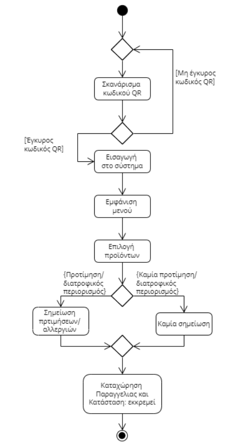

# ΠΧ1. Καταχώρηση παραγγελίας

**Πρωτευων Actor** Πελάτης

**Ενδιαφερόμενοι**
- _Πελάτης_: Θέλει η παραγγελία του να φτάσει στον μπαρίστα.
- _Barista_: Θέλει να βλέπει τις παραγγελίες.

**Προϋποθέσεις** Έχει εκτελεσθεί με επιτυχία η ΠΧ4 και η ΠΧ5 άρα υπάρχει διαθέσιμο μενού και κωδικός σε κάθε τραπέζι.

### Βασική ροή
1. Ο πελάτης σκανάρει τον κωδικό QR του τραπεζιού του.
2. Ο πελάτης εισέρχεται στο σύστημα.
3. Το σύστημα παρουσιάζει το μενού του καταστήματος.
4. Ο πελάτης επιλέγει τα αντικείμενα που επιθυμεί.
5. Το σύστημα καταχωρεί τη παραγγελία και τη βάζει στην ουρά με τις εκκρεμεις παραγγελίες.

### Εναλλακτική ροή

*2α. Μη έγκυρος κωδικός QR*
1. Το σύστημα εμφανίζει μήνυμα μη εγκυρότητας του QR code.
2. H ΠΧ επιστρέφει στο βήμα 1 της βασικής ροής.

### Activity Diagram

