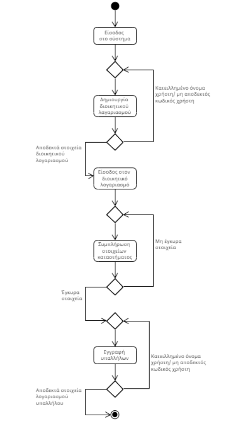

# ΠΧ3. Εγγραφή καφετέριας

**Πρωτεύων Actor**: Διεύθυνση

**Ενδιαφερόμενοι**
- _Διεύθυνση_: Θέλει να εκμεταλλευθεί τα όσα προσφέρει η εφαρμογή.
- _Πελάτης_: Θέλει να μπορεί να παραγγέλνει.
- _Μπαρίστα_: Θέλει να ξέρει τι εκκρεμότητες έχει.

**Προϋποθέσεις**: -

### Βασική ροή
1. Είσοδος στο σύστημα.
2. Συμπλήρωση στοιχείων καταστήματος (επωνυμία κλπ).
3. Εγγραφή υπαλλήλων (όνομα χρήστη και μοναδικό κωδικό).

### Εναλλακτικές ροές

*3α. Μη αποδεκτό όνομα χρήστη*
1. Εμφάνιση μηνύματος μη αποδοχής του ονόματος χρήστη που καταχωρήθηκε.
2. Επιστροφή της ΠΧ στο βήμα 2 της βασικής ροής.

*3β. Ο κωδικός του χρήστη ήδη χρησιμοποιείται*
1. Εμφάνιση μηνύματος μη αποδοχής του κωδικού που καταχωρήθηκε.
2. Επιστροφή της ΠΧ στο βήμα 2 της βασικής ροής.

### Activity Diagram

### Sequence Diagram 
