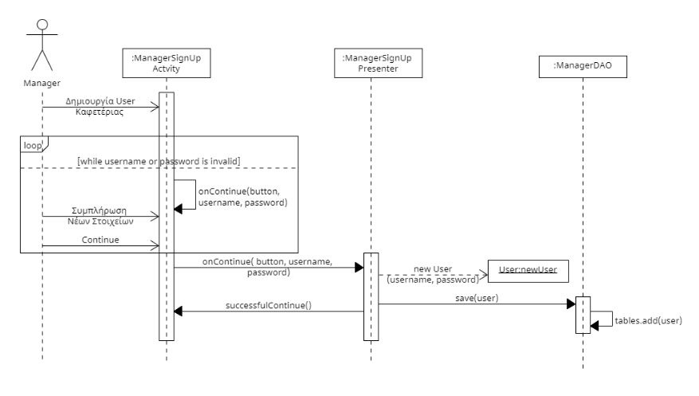

# ΠΧ3. Εγγραφή καφετέριας

**Πρωτεύων Actor**: Διεύθυνση

**Ενδιαφερόμενοι**
- _Διεύθυνση_: Θέλει να εκμεταλλευθεί τα όσα προσφέρει η εφαρμογή.
- _Πελάτης_: Θέλει να μπορεί να παραγγέλνει.
- _Μπαρίστα_: Θέλει να ξέρει τι εκκρεμότητες έχει.

**Προϋποθέσεις**: -

### Βασική ροή
1. Είσοδος στο σύστημα.
2. Δημιουργία διοικητικού λογαριασμού (admin username, admin password).
3. Αυτόματη είσοδος στον διοικητικό λογαριασμό.
4. Συμπλήρωση στοιχείων καταστήματος (επωνυμία, διέυθυνση, τηλέφωνο, ΑΦΜ).
5. Εγγραφή υπαλλήλων (όνομα χρήστη, μοναδικός κωδικός).

### Εναλλακτικές ροές
*2α. Το όνομα χρήστη χρησιμοποιείται ήδη*
1. Εμφάνιση μηνύματος μη αποδοχής του ονόματος χρήστη που καταχωρήθηκε.
2. Επιστροφή της ΠΧ στο βήμα 2 της βασικής ροής.

*2β. Μη αποδεκτός κωδικός χρ΄ήστη*
1. Ο κωδικός περιέχει μη λατινικούς χαρακτήρες ή είναι πολύ μικρού μήκους.
2. Εμφάνιση μηνύματος μη αποδοχής του κωδικού που καταχωρήθηκε.
3. Επιστροφή της ΠΧ στο βήμα 2 της βασικής ροής.

*4α. Λάθος στοιχεία καταστήματος* 
1. Εμφανίζεται μήνυμα μη αποδοχής των στοιχείων του καταστήματος.
2. Επιστροφή της ΠΧ στο βήμα 4 της βασικής ροής. 

*5α. Το όνομα χρήστη χρησιμοποιείται ήδη*
1. Εμφάνιση μηνύματος μη αποδοχής του ονόματος χρήστη που καταχωρήθηκε.
2. Επιστροφή της ΠΧ στο βήμα 5 της βασικής ροής.

*5β. Μη αποδεκτός κωδικός χρ΄ήστη*
1. Ο κωδικός περιέχει μη λατινικούς χαρακτήρες ή είναι πολύ μικρού μήκους.
2. Εμφάνιση μηνύματος μη αποδοχής του κωδικού που καταχωρήθηκε.
3. Επιστροφή της ΠΧ στο βήμα 5 της βασικής ροής.

### Activity Diagram

### Sequence Diagram 
