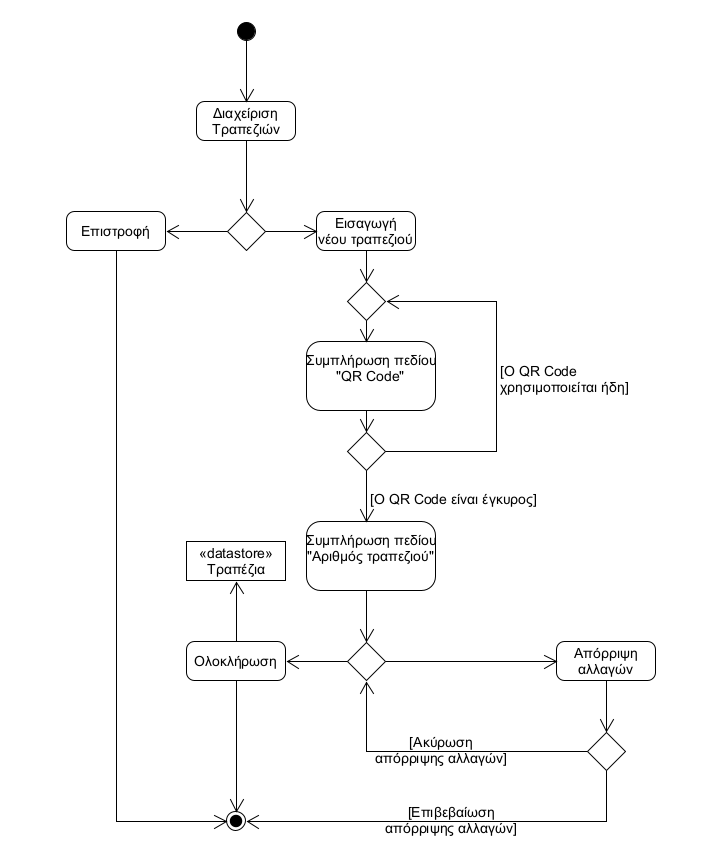

# ΠΧ4. Διαχείριση τραπεζιών

**Πρωτεύων Actor**: Διεύθυνση

**Ενδιαφερόμενοι**
- _Πελάτης_: Θέλει να εισάγει τον μοναδικό κωδικό του τραπεζιού του και να το βρίσκει, με σκοπό να πραγματοποιήσει μια παραγγελία.
- _Barista_: Θέλει να βλέπει σε ποιο τραπέζι αντιστοιχεί η κάθε παραγγελία.

**Προϋποθέσεις**: Η διεύθυνση έχει εκτελέσει με επιτυχία τη ΠΧ3 και έχει συνδεθεί.

## Α) Εισαγωγή τραπεζιού

### Βασική Ροή
1. Από το μενού της διευθύνσης, επιλέγει "Διαχείριση Τραπεζιών".
2. Διαλέγει την επιλογή "Εισαγωγή νέου τραπεζιού".
3. Συμπληρώνει το πεδίο "QR Code τραπεζιού".
4. Συμπληρώνει το πεδίο "Αριθμός τραπεζιού".
5. Το σύστημα εμφανίζει την επιλογή "Ολοκλήρωση".
6. Η διεύθυνση εισάγει το τραπέζι πατώντας το κουμπί "Ολοκλήρωση".
7. Το σύστημα αποθηκεύει το νέο τραπέζι και επιστρέφει στο μενού της διεύθυνσης.

### Εναλλακτικές Ροές

*2α. Η διεύθυνση πατάει το κουμπί "Επιστροφή"*
1. Το σύστημα επιστρέφει στο μενού της διεύθυνσης και η περίπτωση χρήσης τερματίζεται.

*3α. Ο QR Code που εισάγει ο χρήστης χρησιμοποιείται ήδη*
1. Το σύστημα εμφανίζει αντίστοιχο μήνυμα που ζητάει να εισαχθεί διαφορετικός QR Code.
2. Η περίπτωση χρήσης επιστρέφει στο βήμα 3 της βασικής ροής.

*\* Η διεύθυνση πατάει το κουμπί "Απόρριψη αλλαγών"*
1. Το σύστημα εμφανίζει μήνυμα επιβεβαίωσης απόρριψης αλλαγών.
2. Η διεύθυνση διαλέγει "Απόρριψη αλλαγών".

    *2α. Η διεύθυνση διαλέγει "Ακύρωση"*
    1. Η περίπτωση χρήσης επιστρέφει στο τελευταίο βήμα της βασικής ροής που εκτελέστηκε.
3. Το σύστημα επιστρέφει στο μενού της διεύθυνσης και η περίπτωση χρήσης τερματίζεται.

## Β) Διαχείριση υπάρχοντος τραπεζιού

### Βασική Ροή
1. Από το μενού της διεύθυνσης, επιλέγει "Διαχείριση Τραπεζιών".
2. Το σύστημα εμφανίζει λίστα με τα υπάρχοντα τραπέζια.
3. Η διεύθυνση διαλέγει "Επεξεργασία" για κάποιο τραπέζι της λίστας.
4. Η διεύθυνση πραγματοποιεί τις αλλαγές που θέλει.
5. Η διεύθυνση αποθηκεύει τις αλλαγές πατώντας το κουμπί "Ολοκλήρωση".
6. Το σύστημα εμφανίζει μήνυμα επιβεβαίωσης αλλαγών.
7. Η διεύθυνση διαλέγει "Επιβεβαίωση".
8. Το σύστημα αποθηκεύει τις αλλαγές και επιστρέφει στη λίστα με τα υπάρχοντα τραπέζια.

### Εναλλακτικές Ροές

*3α. Η διεύθυνση πατάει το κουμπί "Επιστροφή"*
1. Το σύστημα επιστρέφει στο μενού της διεύθυνσης και η περίπτωση χρήσης τερματίζεται.

*4α. Η διεύθυνση αλλάζει το QR Code και αυτός που εισάγει χρησιμοποιείται ήδη*
1. Το σύστημα απενεργοποιεί το κουμπί "Ολοκλήρωση"
2. Το σύστημα εμφανίζει αντίστοιχο μήνυμα που ζητάει να εισαχθεί διαφορετικός QR Code.
3. Η περίπτωση χρήσης επιστρέφει στο βήμα 4 της βασικής ροής.

*4β. Η διεύθυνση διαλέγει την επιλογή "Διαγραφή τραπεζιού"*
1. Το σύστημα εμφανίζει μήνυμα επιβεβαίωσης διαγραφής.
2. Η διεύθυνση διαλέγει "Επιβεβαίωση".

    *2α. Η διεύθυνση διαλέγει "Ακύρωση"*
    1. Η περίπτωση χρήσης επιστρέφει στο βήμα 4 της βασικής ροής.
3. Το τραπέζι διαγράφεται και η περίπτωση χρήσης επιστρέφει στο βήμα 2 της βασικής ροής.

*5α. Η διεύθυνση πατάει το κουμπί "Απόρριψη αλλαγών"*
1. Το σύστημα εμφανίζει μήνυμα επιβεβαίωσης απόρριψης αλλαγών.
2. Η διεύθυνση διαλέγει "Απόρριψη αλλαγών".

    *2α. Η διεύθυνση διαλέγει "Ακύρωση"*
    1. Η περίπτωση χρήσης επιστρέφει στο βήμα 5 της βασικής ροής.
3. Η περίπτωση χρήσης επιστρέφει στο βήμα 2 της βασικής ροής.

*7α. Η διεύθυνση διαλέγει "Ακύρωση"*
1. Η περίπτωση χρήσης επιστρέφει στο βήμα 4 της βασικής ροής.

### Activity Diagram - Εισαγωγή Τραπεζιού

### Sequence Diagram - Εισαγωγή τραπεζιού 