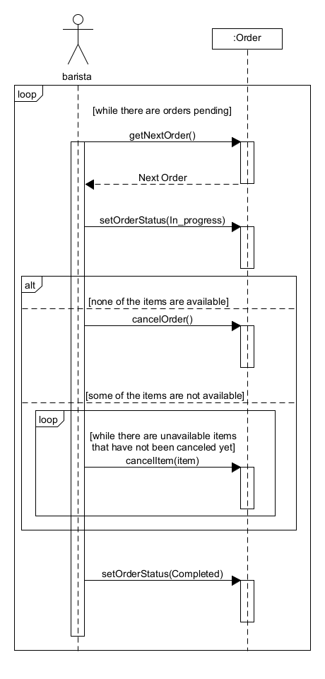

# ΠΧ8. Εκτέλεση παραγγελίας

**Πρωτεύων Actor**: barista

**Ενδιαφερόμενοι**
-_Πελάτης_: Θέλει να ενημερώνεται για την κατάσταση της παραγγελίας του.

**Προϋποθέσεις**: Να έχουν ολοκληρωθεί με επιτυχία η ΠΧ1 και η ΠΧ7.

### Βασική Ροή
1. Ο barista διαλέγει την επιλογή "Προβολή εκκρεμών παραγγελιών".
2. Ο barista ανακατευθύνεται στη σελίδα με τη λίστα των εκκρεμών παραγγελιών.
3. Ο barista διαλέγει την επιλογή "Eπόμενη παραγγελία".
4. Το σύστημα φορτώνει την επόμενη καταχωρημένη παραγγελία στη σειρά προτεραιότητας.
5. Ο barista θέτει την κατάσταση παραγγελίας σε "Σε εξέλιξη".
6. O barista ετοιμάζει τα προϊόντα της παραγγελίας.
7. Ο barista θέτει την κατάσταση παραγγελίας σε "Ολοκληρωμένη".
8. Τα στοιχεία της παραγγελίας αποθηκεύονται στο σύστημα για στατιστικούς σκοπούς.

### Εναλλακτικές Ροές

*6α. Κάποιο προϊόν δεν είναι διαθέσιμο*
1. Ο barista ακυρώνει το προϊόν από την παραγγελία.
2. Το σύστημα ενημερώνει τον πελάτη.
3. Η περίπτωση χρήσης επιστρέφει στο βήμα 6 της βασικής ροής.

*6β. Κανένα προϊόν δεν είναι διαθέσιμο*
1. Ο barista ακυρώνει όλη την παραγγελία.
2. Το σύστημα ενημερώνει τον πελάτη.
3. Η περίπτωση χρήσης τερματίζει.

### Activity Diagram

### Sequence Diagram

